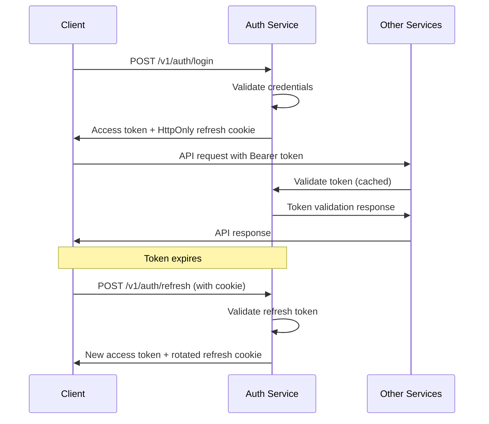
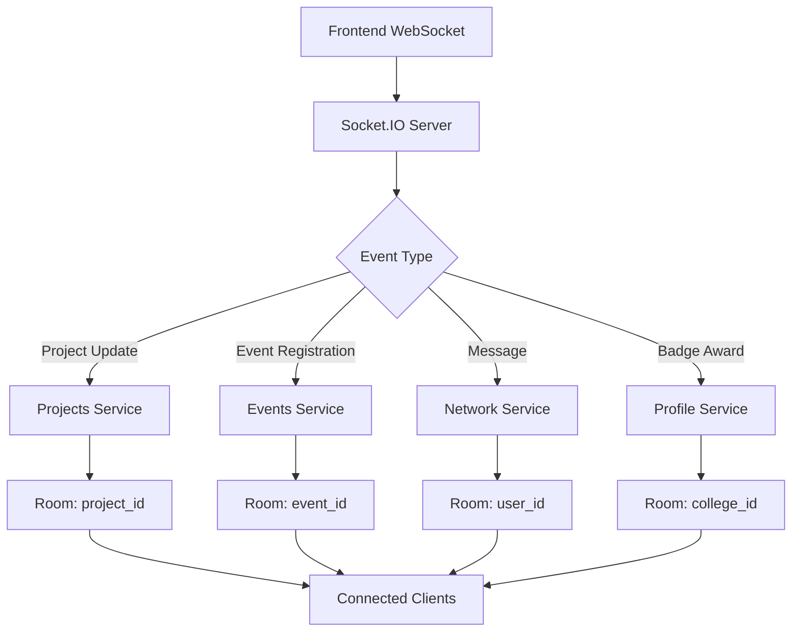

# Nexus Platform Architecture Overview

Comprehensive architecture documentation for the Nexus academic collaboration platform.

## Table of Contents
- [System Architecture](#system-architecture)
- [Technology Stack](#technology-stack)
- [Service Architecture](#service-architecture)
- [Data Flow & Integration](#data-flow--integration)
- [Security Architecture](#security-architecture)
- [Real-time Features](#real-time-features)
- [Deployment Architecture](#deployment-architecture)
- [Performance & Scalability](#performance--scalability)

## System Architecture

Nexus is built as a microservices architecture with a React/Next.js frontend and multiple backend services handling different domains.

```
┌─────────────────────────────────────────────────────────┐
│                    Frontend Layer                       │
│  ┌─────────────────────────────────────────────────────┐│
│  │           Next.js Application                       ││
│  │  ┌─────────┐ ┌─────────┐ ┌─────────┐ ┌─────────┐   ││
│  │  │  Auth   │ │Profile  │ │Projects │ │ Events  │   ││
│  │  │   UI    │ │   UI    │ │   UI    │ │   UI    │   ││
│  │  └─────────┘ └─────────┘ └─────────┘ └─────────┘   ││
│  │                                                     ││
│  │  ┌─────────────────────────────────────────────────┐││
│  │  │        Redux Store + WebSocket Manager         │││
│  │  └─────────────────────────────────────────────────┘││
│  └─────────────────────────────────────────────────────┘│
└─────────────────────────────────────────────────────────┘
                              │
                              │ HTTPS/WSS
                              ▼
┌─────────────────────────────────────────────────────────┐
│                   API Gateway Layer                     │
│  ┌─────────────────────────────────────────────────────┐│
│  │              Load Balancer/Proxy                    ││
│  └─────────────────────────────────────────────────────┘│
└─────────────────────────────────────────────────────────┘
                              │
                              │
        ┌─────────────────────┼─────────────────────┐
        │                     │                     │
        ▼                     ▼                     ▼
┌─────────────┐    ┌─────────────┐    ┌─────────────┐
│Auth Service │    │Profile Svc  │    │Projects Svc │
│   :3001     │    │   :3002     │    │   :4003     │
│             │    │             │    │             │
│ ┌─────────┐ │    │ ┌─────────┐ │    │ ┌─────────┐ │
│ │   JWT   │ │    │ │Profiles │ │    │ │Projects │ │
│ │  Auth   │ │    │ │ Badges  │ │    │ │  Tasks  │ │
│ │ OAuth   │ │    │ │ Pubs    │ │    │ │Comments │ │
│ └─────────┘ │    │ └─────────┘ │    │ └─────────┘ │
│             │    │             │    │             │
│ ┌─────────┐ │    │ ┌─────────┐ │    │ ┌─────────┐ │
│ │Auth DB  │ │    │ │Profile  │ │    │ │Projects │ │
│ │(Postgres│ │    │ │DB       │ │    │ │DB       │ │
│ └─────────┘ │    │ └─────────┘ │    │ └─────────┘ │
└─────────────┘    └─────────────┘    └─────────────┘
        │                     │                     │
        │                     │                     │
        ▼                     ▼                     ▼
┌─────────────┐    ┌─────────────┐    ┌─────────────┐
│Events Svc   │    │Network Svc  │    │ Redis Cache │
│   :4004     │    │   :4005     │    │   :6379     │
│             │    │             │    │             │
│ ┌─────────┐ │    │ ┌─────────┐ │    │ ┌─────────┐ │
│ │ Events  │ │    │ │ Social  │ │    │ │ Session │ │
│ │Registr. │ │    │ │ Posts   │ │    │ │ Cache   │ │
│ │Approval │ │    │ │Messages │ │    │ │ Auth    │ │
│ └─────────┘ │    │ └─────────┘ │    │ │ Cache   │ │
│             │    │             │    │ └─────────┘ │
│ ┌─────────┐ │    │ ┌─────────┐ │    └─────────────┘
│ │Events   │ │    │ │Network  │ │
│ │DB       │ │    │ │DB       │ │
│ └─────────┘ │    │ └─────────┘ │
└─────────────┘    └─────────────┘
```

## Technology Stack

### Frontend
- **Framework**: Next.js 14 (App Router)
- **Language**: TypeScript
- **Styling**: Tailwind CSS + shadcn/ui components
- **State Management**: Redux Toolkit
- **Authentication**: NextAuth.js with custom JWT provider
- **HTTP Client**: Axios with interceptors
- **Real-time**: Socket.IO client
- **Forms**: React Hook Form + Zod validation
- **Animations**: Framer Motion

### Backend Services
- **Runtime**: Node.js with Express.js
- **Language**: TypeScript
- **Database**: PostgreSQL with Prisma ORM
- **Authentication**: JWT (RS256) + HttpOnly refresh tokens
- **Validation**: Zod schemas
- **Real-time**: Socket.IO
- **Caching**: Redis
- **File Upload**: Cloudinary integration
- **Email**: Nodemailer

### Infrastructure
- **Database**: PostgreSQL (separate DB per service)
- **Cache**: Redis for session and auth caching
- **File Storage**: Cloudinary for media uploads
- **Deployment**: Local development (Docker deprecated)
- **Monitoring**: Console logging with structured formats

## Service Architecture

### Microservices Design Principles
1. **Domain-Driven Design**: Each service owns a specific business domain
2. **Database per Service**: No shared databases between services
3. **API-First**: RESTful APIs with OpenAPI documentation
4. **Stateless Services**: All state stored in databases or cache
5. **Loose Coupling**: Services communicate via HTTP APIs only

### Service Responsibilities

#### Auth Service (:3001)
- **Domain**: Authentication, authorization, user identity
- **Features**:
  - JWT token generation and validation (RS256)
  - OAuth integration (Google, GitHub)
  - User registration and email verification
  - Password reset flows
  - Role-based access control
  - HttpOnly refresh token rotation
- **Database**: Users, OAuth accounts, security tokens, preferences

#### Profile Service (:3002)
- **Domain**: User profiles, academic data, badges
- **Features**:
  - User profile management (bio, skills, contact info)
  - College and department management
  - Personal projects and publications
  - Badge system with award tracking
  - Academic year and department filtering
- **Database**: Profiles, colleges, publications, personal projects, badges

#### Projects Service (:4003)
- **Domain**: Collaborative projects and applications
- **Features**:
  - Project creation and management
  - Student application system
  - Task management and collaboration
  - File attachments and comments
  - Real-time project updates
  - Department-based visibility
- **Database**: Projects, applications, tasks, attachments, comments

#### Events Service (:4004)
- **Domain**: Event management and registration
- **Features**:
  - Event creation with badge-gating for students
  - Registration and capacity management
  - Approval workflows for student events
  - CSV export for registrations
  - Real-time registration updates
- **Database**: Events, registrations, approval flows

#### Network Service (:4005)
- **Domain**: Social networking and messaging
- **Features**:
  - Social posts and feeds
  - Following/followers system
  - Private messaging
  - Real-time notifications
  - User discovery and suggestions
- **Database**: Posts, follows, messages, conversations

## Data Flow & Integration

### Authentication Flow


### Cross-Service Communication
- **Service-to-Service**: HTTP REST APIs with JWT validation
- **Data Consistency**: Eventual consistency with application-level integrity
- **Error Handling**: Circuit breaker patterns and graceful degradation
- **Caching**: Redis for frequently accessed auth data

### Real-time Data Flow


## Security Architecture

### Authentication & Authorization
- **JWT Tokens**: RS256 signed access tokens (15-minute expiry)
- **Refresh Tokens**: HttpOnly cookies with rotation (7-day expiry)
- **Role-Based Access**: Hierarchical roles with service-level enforcement
- **College Isolation**: Users can only access data within their college

### Role Hierarchy
```
HEAD_ADMIN (College-wide access)
    ├── DEPT_ADMIN (Department-level access)
    ├── PLACEMENTS_ADMIN (Placement-specific access)
    ├── FACULTY (Teaching and research access)
    └── STUDENT (Basic access with restrictions)
```

### Security Measures
1. **Input Validation**: Zod schemas on all endpoints
2. **SQL Injection Prevention**: Prisma ORM with parameterized queries
3. **XSS Protection**: Content sanitization and CSP headers
4. **CSRF Protection**: SameSite cookies and token validation
5. **Rate Limiting**: API rate limits on sensitive endpoints
6. **CORS Configuration**: Strict origin and credential policies

### Data Protection
- **Encryption at Rest**: Database-level encryption
- **Encryption in Transit**: HTTPS/TLS for all communications
- **Sensitive Data**: Password hashing with bcrypt
- **PII Handling**: Minimal data collection with user consent
- **Audit Logging**: Security events and admin actions

## Real-time Features

### WebSocket Architecture
- **Technology**: Socket.IO with JWT authentication
- **Connection Management**: Automatic reconnection with exponential backoff
- **Room-based Messaging**: Targeted updates to relevant users
- **Event Types**: Project updates, event registrations, messages, notifications

### Real-time Capabilities
1. **Project Collaboration**: Live task updates, comments, file uploads
2. **Event Management**: Registration counts, approval notifications
3. **Social Features**: Message delivery, typing indicators, online status
4. **Badge Notifications**: Real-time badge awards and achievements
5. **System Notifications**: Admin alerts, escalations, announcements

### Performance Optimization
- **Connection Pooling**: Efficient WebSocket connection management
- **Message Queuing**: Redis-backed message persistence
- **Load Balancing**: Sticky sessions for WebSocket connections
- **Graceful Degradation**: Fallback to polling for connection issues

## Deployment Architecture

### Development Environment
- **Local Services**: Each service runs on different ports
- **Database**: PostgreSQL with separate schemas per service
- **Cache**: Redis for session and auth caching
- **File Storage**: Cloudinary for development and production

### Service Ports
```
Frontend (Next.js):     3000
Auth Service:           3001
Profile Service:        3002
Projects Service:       4003
Events Service:         4004
Network Service:        4005
PostgreSQL:             5432
Redis:                  6379
```

### Environment Configuration
- **Service URLs**: Configurable via environment variables
- **Database URLs**: Separate connection strings per service
- **JWT Keys**: RS256 key pairs for token signing
- **OAuth Credentials**: Provider-specific client IDs and secrets
- **External APIs**: Cloudinary, email service configurations

### Production Considerations
- **Containerization**: Docker images for each service
- **Orchestration**: Kubernetes or Docker Compose
- **Load Balancing**: Nginx or cloud load balancers
- **SSL Termination**: HTTPS certificates and TLS configuration
- **Monitoring**: Application performance monitoring and logging
- **Backup Strategy**: Database backups and disaster recovery

## Performance & Scalability

### Database Optimization
- **Indexing Strategy**: Optimized indexes on frequently queried fields
- **Query Optimization**: Efficient Prisma queries with proper relations
- **Connection Pooling**: Database connection management
- **Read Replicas**: Potential for read-heavy workload distribution

### Caching Strategy
- **Redis Cache**: Auth tokens, user sessions, frequently accessed data
- **Application Cache**: In-memory caching for static data
- **CDN**: Static asset delivery optimization
- **Browser Cache**: Appropriate cache headers for frontend assets

### Scalability Patterns
1. **Horizontal Scaling**: Multiple service instances behind load balancers
2. **Database Sharding**: College-based data partitioning
3. **Microservice Independence**: Services can scale independently
4. **Async Processing**: Background jobs for heavy operations
5. **Event-Driven Architecture**: Loose coupling for better scalability

### Monitoring & Observability
- **Health Checks**: Service health endpoints for monitoring
- **Metrics Collection**: Performance metrics and business KPIs
- **Error Tracking**: Centralized error logging and alerting
- **Distributed Tracing**: Request tracing across services
- **Performance Monitoring**: Response times and throughput tracking

## Future Architecture Considerations

### Planned Enhancements
1. **API Gateway**: Centralized routing and rate limiting
2. **Service Mesh**: Enhanced service-to-service communication
3. **Event Sourcing**: Audit trails and event replay capabilities
4. **CQRS**: Command Query Responsibility Segregation for complex domains
5. **Microservice Orchestration**: Workflow management for complex operations

### Technology Evolution
- **GraphQL**: Potential migration from REST for better frontend integration
- **gRPC**: High-performance service-to-service communication
- **Message Queues**: Async communication with RabbitMQ or Apache Kafka
- **Container Orchestration**: Kubernetes for production deployment
- **Cloud Migration**: AWS/GCP/Azure for managed services and scalability

This architecture provides a solid foundation for the Nexus platform with clear separation of concerns, robust security, and scalability for future growth.
