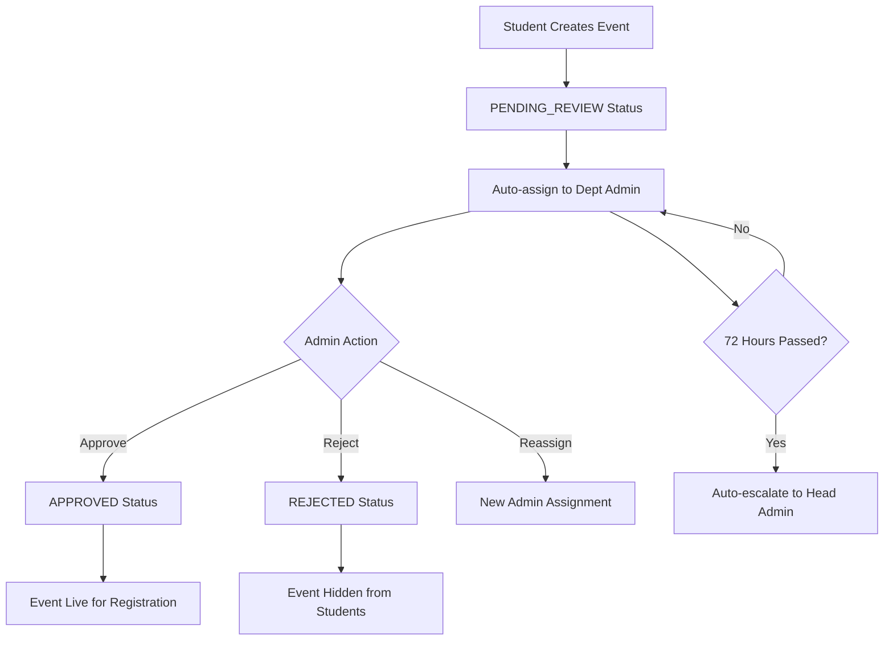

# Nexus Events System - Comprehensive Documentation

Complete documentation of the Events system endpoints, features, and role-based access control.

## Table of Contents
- [System Overview](#system-overview)
- [Backend API Endpoints](#backend-api-endpoints)
- [Frontend Features by Role](#frontend-features-by-role)
- [Data Models & Types](#data-models--types)
- [Authentication & Authorization](#authentication--authorization)
- [Event Lifecycle & Workflows](#event-lifecycle--workflows)
- [Badge System Integration](#badge-system-integration)
- [Real-time Features](#real-time-features)
- [Export & Analytics](#export--analytics)

## System Overview

The Nexus Events system is a comprehensive event management platform with role-based access control, badge-gated creation for students, approval workflows, and real-time notifications.

### Key Features
- **Role-based Access Control**: Different capabilities for Students, Faculty, Dept Admins, and Head Admins
- **Badge-gated Creation**: Students must unlock 8 default badges to create events
- **Approval Workflows**: Automated assignment to department admins with escalation policies
- **Real-time Updates**: WebSocket notifications for approvals, rejections, and registrations
- **Capacity Management**: Strict enforcement of event capacity limits
- **CSV Export**: Registration data export for faculty and admins
- **Department Visibility**: Events can be college-wide or department-specific

## Backend API Endpoints

### Base Configuration
- **Service URL**: `http://localhost:4004` (configurable via `EVENTS_BASE_URL`)
- **Authentication**: JWT Bearer tokens required for all endpoints
- **CORS**: Configured to expose `Content-Disposition` header for CSV downloads

### Public Endpoints (Authenticated Users)

#### `GET /v1/events`
List events with filtering and pagination.

**Query Parameters:**
```typescript
{
  q?: string;                    // Search in title/description
  department?: string;           // Filter by department
  type?: EventType;             // WORKSHOP | SEMINAR | HACKATHON | MEETUP
  mode?: EventMode;             // ONLINE | ONSITE | HYBRID
  status?: ModerationStatus;    // PENDING_REVIEW | APPROVED | REJECTED
  from?: string;                // ISO datetime - start date filter
  to?: string;                  // ISO datetime - end date filter
  upcomingOnly?: boolean;       // Only future events
  page?: number;                // Page number (default: 1)
  limit?: number;               // Items per page (default: 20, max: 100)
}
```

**Response:**
```typescript
{
  events: Event[];
  total: number;
  page: number;
  limit: number;
}
```

**Role-based Filtering:**
- **Students**: Only see `APPROVED` events visible to their department
- **Faculty/Admins**: See all events in their college, can filter by `status`

#### `GET /v1/events/:id`
Get single event by ID with registration status.

**Response:**
```typescript
{
  event: Event & {
    registrationCount: number;
    isRegistered: boolean;
  }
}
```

#### `GET /v1/events/mine`
Get user's events (authored + registered for students, authored + monitored for faculty).

**Response:**
```typescript
{
  events: Event[];
}
```

#### `POST /v1/events`
Create a new event.

**Request Body:**
```typescript
{
  title: string;
  description: string;
  startAt: string;              // ISO datetime
  endAt: string;                // ISO datetime
  type: EventType;
  mode: EventMode;
  location?: string;            // Required for ONSITE/HYBRID
  meetingUrl?: string;          // Required for ONLINE/HYBRID
  capacity?: number;            // Optional capacity limit
  visibleToAllDepts?: boolean;  // Default: true
  departments?: string[];       // Required if visibleToAllDepts is false
  tags?: string[];
}
```

**Role-based Behavior:**
- **Students**: Must pass badge eligibility check, event goes to `PENDING_REVIEW`
- **Faculty/Admins**: Event auto-approved to `APPROVED` status

#### `PUT /v1/events/:id`
Update an existing event.

**Permissions:**
- **Students**: Can only edit own events in `PENDING_REVIEW` status
- **Faculty/Admins**: Can edit any event in their college

#### `DELETE /v1/events/:id`
Delete an event.

**Permissions:**
- **Students**: Can only delete own events in `PENDING_REVIEW` status
- **Faculty/Admins**: Can delete any event in their college

### Registration Endpoints

#### `POST /v1/events/:id/register`
Register for an event.

**Requirements:**
- Event must be `APPROVED`
- Capacity must not be exceeded
- User cannot be already registered

**Response:**
```typescript
{
  registration: {
    id: string;
    eventId: string;
    userId: string;
    joinedAt: string;
  }
}
```

#### `DELETE /v1/events/:id/register`
Unregister from an event.

### Admin-only Endpoints

#### `PATCH /v1/events/:id/moderate`
Moderate an event (Dept Admin, Head Admin only).

**Request Body:**
```typescript
{
  action: "APPROVE" | "REJECT" | "ASSIGN";
  monitorId?: string;           // For APPROVE/ASSIGN actions
  monitorName?: string;
  mentorId?: string;            // Alternative field name
  mentorName?: string;
  rejectionReason?: string;     // For REJECT action
}
```

**Actions:**
- **APPROVE**: Set status to `APPROVED`, optionally assign monitor
- **REJECT**: Set status to `REJECTED`, optionally provide reason
- **ASSIGN**: Reassign approval to different admin

#### `GET /v1/events/:id/export`
Export event registrations as CSV (Faculty only).

**Response:**
- Content-Type: `text/csv; charset=utf-8`
- Content-Disposition: `attachment; filename="event_registrations.csv"`

**CSV Columns:**
- userId, department, year, collegeMemberId, joinedAt
- linkedIn, github, twitter, resumeUrl, contactInfo

### Student-specific Endpoints

#### `GET /v1/events/eligibility`
Check badge eligibility for event creation (Students only).

**Response:**
```typescript
{
  canCreate: boolean;
  missingBadges: string[];      // List of required badge names
}
```

## Frontend Features by Role

### Student Features

#### Event Discovery & Registration
- **Component**: `StudentEventInterface.tsx`
- **Route**: `/student/events` (protected by RoleGuard)
- **Features**:
  - Browse approved events with search and filters
  - Register/unregister with real-time capacity updates
  - Event calendar view with "My Registrations" tab
  - Event type badges and status indicators
  - Mobile-responsive card layout with glassmorphism design

#### Event Creation (Badge-gated)
- **Component**: `CreateEventModal.tsx`
- **Requirements**: Must unlock 8 default badges first
- **Features**:
  - Badge eligibility checker with progress indicator
  - Form validation for required fields based on event mode
  - Department visibility controls
  - Real-time preview of event details
  - Submission creates event in `PENDING_REVIEW` status

#### Event Management
- **Edit**: Only own events in `PENDING_REVIEW` status
- **Delete**: Only own events in `PENDING_REVIEW` status
- **Notifications**: Real-time updates on approval/rejection

### Faculty Features

#### Event Management
- **Component**: `EventMonitoringInterface.tsx`
- **Route**: `/faculty/events` (protected by RoleGuard)
- **Features**:
  - Create events (auto-approved)
  - Monitor assigned events
  - Export registration data to CSV
  - Bulk event operations
  - Advanced filtering and search

#### Event Monitoring
- **Assigned Events**: Events where faculty is set as monitor
- **Registration Analytics**: View registration trends and demographics
- **CSV Export**: Download participant data with contact information
- **Real-time Updates**: Live registration count updates

### Department Admin Features

#### Event Moderation
- **Component**: `EventModerationInterface.tsx`
- **Route**: `/dept-admin/events` (protected by RoleGuard)
- **Features**:
  - Approve/reject pending events
  - Assign faculty monitors to events
  - Reassign events to other admins
  - Bulk moderation actions
  - Escalation management

#### Approval Workflows
- **Auto-assignment**: New student events automatically assigned
- **Escalation**: Events auto-escalate after 72 hours (configurable)
- **Notifications**: Real-time alerts for new submissions
- **Audit Trail**: Complete approval history tracking

### Head Admin Features

#### College-wide Management
- **Full Access**: All events across the college
- **Override Powers**: Can moderate any event regardless of department
- **Analytics Dashboard**: College-wide event statistics
- **Policy Management**: Configure escalation policies and approval flows

#### System Administration
- **Bulk Operations**: Mass approve/reject events
- **Department Oversight**: Monitor all department admin activities
- **Backup Approver**: Automatic escalation target for unhandled events

## Data Models & Types

### Core Event Model
```typescript
interface Event {
  id: string;
  collegeId: string;
  authorId: string;
  authorName: string;
  authorRole: string;
  title: string;
  description: string;
  startAt: string;              // ISO datetime
  endAt: string;                // ISO datetime
  type: EventType;              // WORKSHOP | SEMINAR | HACKATHON | MEETUP
  mode: EventMode;              // ONLINE | ONSITE | HYBRID
  location?: string | null;
  meetingUrl?: string | null;
  capacity?: number | null;
  visibleToAllDepts: boolean;
  departments: string[];
  tags: string[];
  moderationStatus: ModerationStatus; // PENDING_REVIEW | APPROVED | REJECTED
  monitorId?: string | null;    // Assigned faculty monitor
  monitorName?: string | null;
  createdAt: string;
  updatedAt: string;
  archivedAt?: string | null;
  // Derived fields
  registrationCount?: number;
  isRegistered?: boolean;
}
```

### Event Registration Model
```typescript
interface EventRegistration {
  id: string;
  eventId: string;
  userId: string;
  joinedAt: string;
}
```

### Approval Flow Model
```typescript
interface EventApprovalFlow {
  id: string;
  eventId: string;
  submittedAt: string;
  assignedTo?: string;
  assignedToName?: string;
  escalatedAt?: string;
  escalatedTo?: string;
  escalatedToName?: string;
  approvedAt?: string;
  approvedBy?: string;
  approvedByName?: string;
  rejectedAt?: string;
  rejectedBy?: string;
  rejectedByName?: string;
  rejectionReason?: string;
  mentorAssigned?: string;
  mentorName?: string;
  isEscalated: boolean;
}
```

## Authentication & Authorization

### Role Hierarchy
1. **STUDENT**: Basic event participation, badge-gated creation
2. **FACULTY**: Event creation, monitoring, CSV export
3. **DEPT_ADMIN**: Department-level moderation and approval
4. **HEAD_ADMIN**: College-wide administration and oversight

### Permission Matrix

| Action | Student | Faculty | Dept Admin | Head Admin |
|--------|---------|---------|------------|------------|
| View Events | ✅ (Approved only) | ✅ (All in college) | ✅ (All in college) | ✅ (All in college) |
| Create Events | ✅ (Badge-gated) | ✅ (Auto-approved) | ✅ (Auto-approved) | ✅ (Auto-approved) |
| Edit Events | ✅ (Own, pending only) | ✅ (Any in college) | ✅ (Any in college) | ✅ (Any in college) |
| Delete Events | ✅ (Own, pending only) | ✅ (Any in college) | ✅ (Any in college) | ✅ (Any in college) |
| Moderate Events | ❌ | ❌ | ✅ (Department) | ✅ (College-wide) |
| Register for Events | ✅ | ✅ | ✅ | ✅ |
| Export Registrations | ❌ | ✅ (Own/monitored) | ✅ (Department) | ✅ (College-wide) |
| Assign Monitors | ❌ | ❌ | ✅ | ✅ |

### Department Visibility Rules
- **visibleToAllDepts: true**: Event visible to entire college
- **visibleToAllDepts: false**: Event visible only to specified departments
- **Students**: Can only see events visible to their department
- **Faculty/Admins**: Can see all events in their college regardless of department restrictions

## Event Lifecycle & Workflows

### Student Event Creation Flow
1. **Eligibility Check**: Verify 8 required badges unlocked
2. **Event Creation**: Submit event with `PENDING_REVIEW` status
3. **Auto-assignment**: System assigns to department admin
4. **Approval Process**: Admin approves/rejects/assigns monitor
5. **Escalation**: Auto-escalate after 72 hours if unhandled
6. **Notification**: Real-time updates to student and stakeholders

### Faculty Event Creation Flow
1. **Direct Creation**: Event immediately set to `APPROVED` status
2. **Optional Monitor**: Can self-assign as monitor
3. **Immediate Visibility**: Event becomes available for registration

### Approval Workflow Details


## Badge System Integration

### Required Badges for Students
Students must unlock these 8 default badges before creating events:

1. **Team Player** - Collaboration and teamwork
2. **Leadership** - Leading projects or initiatives
3. **Innovation** - Creative problem-solving
4. **Problem Solver** - Technical challenge resolution
5. **Research Excellence** - Academic research contributions
6. **Community Impact** - Social responsibility projects
7. **Outstanding Presentation** - Communication skills
8. **Top Contributor** - Consistent high-quality contributions

### Badge Eligibility API
- **Endpoint**: `GET /v1/events/eligibility`
- **Integration**: Profile service badge tracking
- **Response**: Eligibility status and missing badge list
- **UI Integration**: Progress indicators and requirement messaging

### Badge Progress Tracking
```typescript
interface EventEligibility {
  canCreate: boolean;
  missingBadges: string[];
  badgesEarned?: number;        // Current badge count
  badgesRequired?: number;      // Required badge count (8)
  progressPercentage?: number;  // Completion percentage
}
```

## Real-time Features

### WebSocket Integration
- **Server**: Socket.IO server in event-service
- **Authentication**: JWT-based WebSocket authentication
- **Rooms**: User-specific and role-based rooms

### Real-time Events
1. **Event Approval**: Notify student when event approved/rejected
2. **Registration Updates**: Live capacity and registration count updates
3. **Assignment Notifications**: Alert admins of new event assignments
4. **Escalation Alerts**: Notify head admins of escalated events
5. **Monitor Assignment**: Alert faculty when assigned as event monitor

### WebSocket Event Types
```typescript
// Event approval/rejection
{
  type: 'event-approved' | 'event-rejected',
  eventId: string,
  eventTitle: string,
  monitorId?: string,
  monitorName?: string,
  rejectionReason?: string
}

// Registration updates
{
  type: 'registration-update',
  eventId: string,
  registrationCount: number,
  capacity?: number
}

// Admin notifications
{
  type: 'event-assignment',
  eventId: string,
  eventTitle: string,
  assignedTo: string,
  assignedBy: string
}
```

## Export & Analytics

### CSV Export Features
- **Endpoint**: `GET /v1/events/:id/export`
- **Access**: Faculty (own/monitored events), Admins (department/college)
- **Format**: UTF-8 CSV with BOM for Excel compatibility
- **Filename**: Auto-generated with event title and timestamp

### Export Data Fields
```csv
userId,department,year,collegeMemberId,joinedAt,linkedIn,github,twitter,resumeUrl,contactInfo
```

### Analytics Capabilities
1. **Registration Trends**: Track registration patterns over time
2. **Department Participation**: Cross-department engagement metrics
3. **Event Type Popularity**: Most popular event types and formats
4. **Capacity Utilization**: Event capacity vs actual attendance
5. **Badge Impact**: Correlation between badges and event creation

### Frontend Export Implementation
```typescript
// Download CSV export
const handleExport = async (eventId: string) => {
  try {
    const { blob, filename } = await eventsApi.exportRegistrations(eventId);
    const url = URL.createObjectURL(blob);
    const a = document.createElement('a');
    a.href = url;
    a.download = filename;
    document.body.appendChild(a);
    a.click();
    a.remove();
    URL.revokeObjectURL(url);
    toast.success('Registration data exported successfully');
  } catch (error) {
    toast.error('Failed to export registration data');
  }
};
```

## Error Handling & Edge Cases

### Common Error Scenarios
1. **Capacity Exceeded**: Event registration when capacity full
2. **Badge Insufficient**: Student trying to create without required badges
3. **Permission Denied**: Unauthorized moderation attempts
4. **Time Conflicts**: Event scheduling conflicts
5. **Invalid Data**: Malformed dates or required field validation

### Error Response Format
```typescript
{
  message: string;
  code?: string;
  details?: any;
}
```

### Frontend Error Handling
- **401 Unauthorized**: Auto-refresh JWT token via Axios interceptors
- **403 Forbidden**: Show permission denied message with role requirements
- **409 Conflict**: Handle registration conflicts gracefully
- **422 Validation**: Display field-specific validation errors
- **500 Server Error**: Generic error handling with retry options

## Security Considerations

### Data Protection
- **JWT Authentication**: All endpoints require valid JWT tokens
- **Role-based Access**: Strict permission checking on all operations
- **College Isolation**: Users can only access events within their college
- **Input Validation**: Comprehensive Zod schema validation

### Privacy Controls
- **Department Visibility**: Granular control over event visibility
- **Registration Privacy**: User registration data only visible to authorized roles
- **Export Restrictions**: CSV export limited to faculty and admins
- **Audit Logging**: Complete audit trail for all moderation actions

### Rate Limiting & Abuse Prevention
- **Registration Limits**: Prevent spam registrations
- **Creation Throttling**: Limit event creation frequency
- **Badge Verification**: Server-side badge eligibility checking
- **Capacity Enforcement**: Strict capacity limits with transaction isolation

This comprehensive documentation covers all aspects of the Nexus Events system, from backend API endpoints to frontend features, organized by role-based access control and complete workflow documentation.
